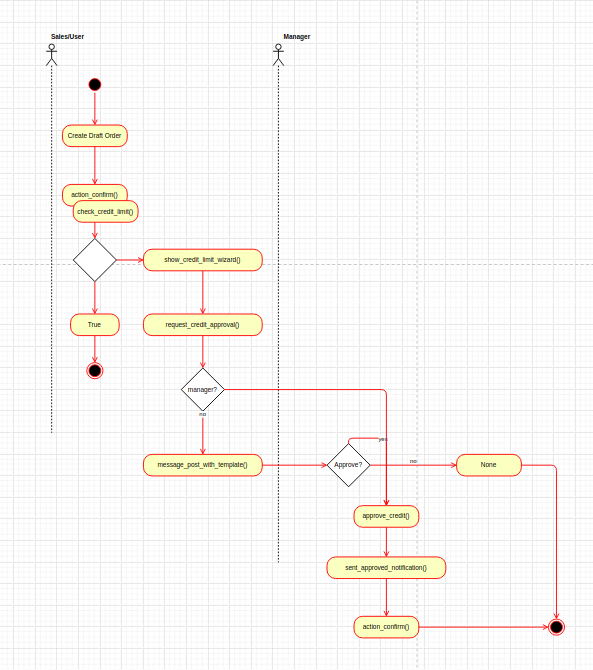
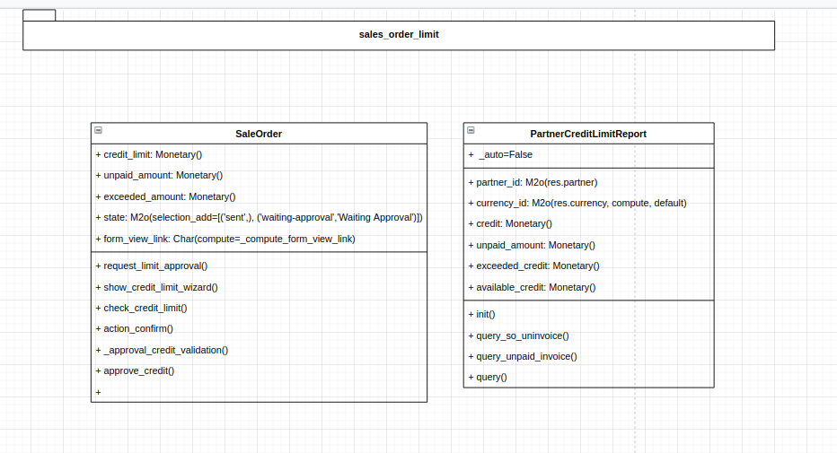
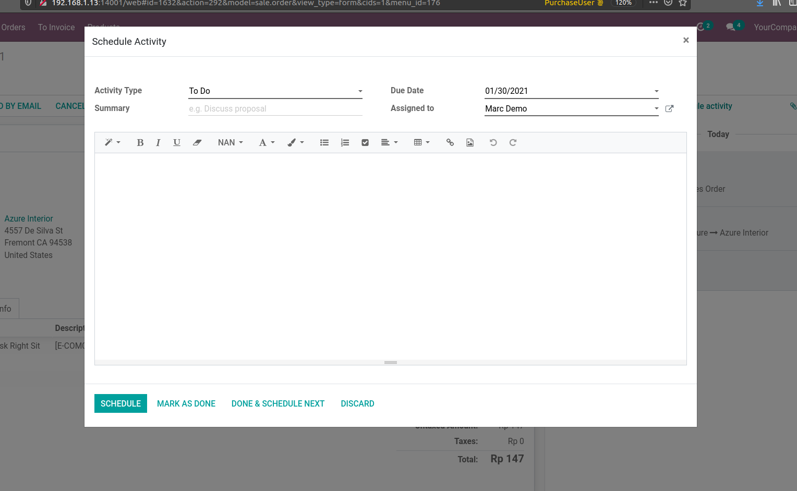
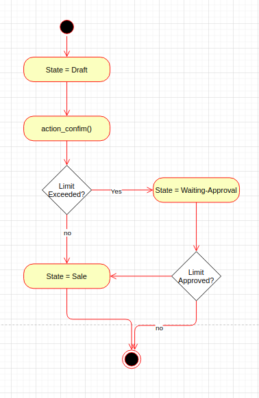

# Requirement 
https://docs.google.com/document/d/10O_S6mFLSLniLQd2rF839OWamSSgGeuoaDA2yNd2u_I/edit

- Control the amount of outstanding dues of customers in Odoo.
- Reduces the risk of outstanding dues increasing beyond a limit in your business.
- No more manual tracking of customer's dues.
- The customer Credit limit acts as an automatic check to manage your revenue stuck in dues and still not received.
- Allow the manager/admin to be aware about the orders that exceed the set credit limit of customers.
- It makes sure that the customers do not make purchases with huge outstanding dues in Odoo.


# Technical Design
## Activity Diagram


## Class Diagram



## Questions to Improve
1. FRD not explain how if manager not approve the order exceeded request.
2. On Wizard only tell unpaid invoice, even need to confirmed order not invoiced yet should be shown to give better analysis.
3. While Sales user reuqest approval is better to lock the form/record so it couldn't be edit / update.
4. Multi currency support?
5. Better to do list (approval) with Schedule Action (image below)


# Test Scenario

There's 3 category test:

1. Common: Basic functionality of calculating limit status of all partner using sql view
2. Sale: Sale flow testing as a required on https://docs.google.com/document/d/10O_S6mFLSLniLQd2rF839OWamSSgGeuoaDA2yNd2u_I/edit
3. Performance: Test with creating 30 invoices (mixed with paid/not) then try to access sql view in each partner


You can run unit test by: 

```bash
odoo-bin -d dbname -i sale_order_limit --test-enable
```

available test-tags: standard, sale, performance


** Require demo data to run


Test Common:
###

Tag: standard, common

Ensure query to calculate remainig credit run well
- Only confirmed order should be calculated as unpaid orders
- Remaining credit = (Confirmed order amount(Not invoiced) + Unpaid Order (Invoiced) ) - Current Amount Order
- When order not moved to sale/done should not calculated as confirmed amount
- When order Invoiced should not doubled calculated as confirmed order
- When order paid, then should not calculated as unpaid amount, remaining credit will increased.


Test Sale
###

Tag: standard, sale

Ensure Sale flow




Test 01:
----
Confirm order when customer limit exeeceed

1. New Order with Partner which has limit 100 and total order more than the limit. 
2. When sales confirm the order will show pop up to show exceeded information
3. Then user can request to approval
4. Email Sent to manager
5. Approval only can  be perform by sales manager, should be raise Error if approved by non sales manager user
6. After manager approve the request then sales state move into sale/done


Test 02:
----
Confirm order when customer limit not exeeded

1. New order with Partner has limit 2 million and curent order less than the limit
2. When sales confirm an order should be directly approved and sale state moved to sale/done


Test 03:
----
Confrim exceeded limit customer with sales manager user

1. Customer limit is exceeded
2. Manager confirm order from draft order
3. Move state to sale/done.


Test Performance
###

Tag: standard, performance


Test 04 Performance:
----
Will use cProfile to get execution time

1. Create each 30 order on each customers
2. Invoice created and merged into 1
3. Create new so with exceeded limit then calculate timing until

# Benchmark
Benchmark result was performed when do unit test
odoo-bin -d dbname -i sale_order_limit --test-enable

or you can do specific performance tags to do a unit test

```bash
odoo-bin -d dbname -i sale_order_limit --test-enable --test-tags performance
```

the profiling result will saved to ``/sale_order_limit/tests/results/profiling/performance.txt``


As my test on local: to compute remaining limit / exceeded limit from sql_view in order have 10 invoices pending just took 0.016 sec and on 30 invoices (3 times large) 0.020 sec